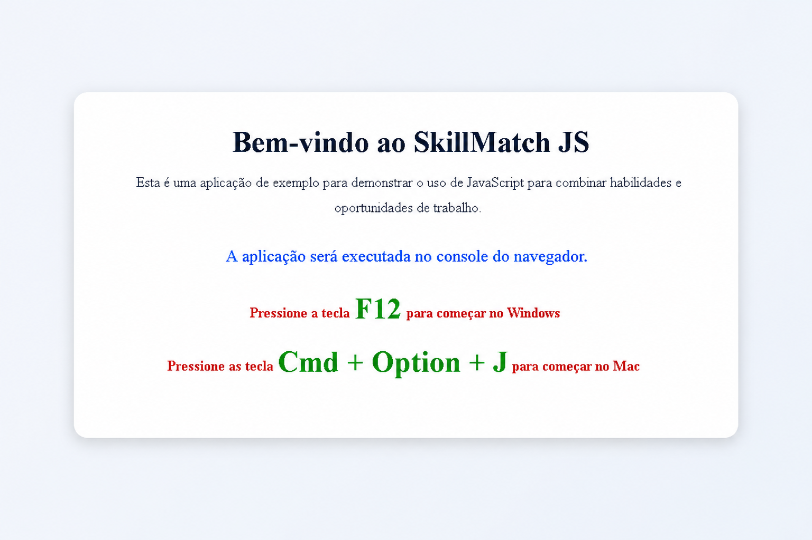
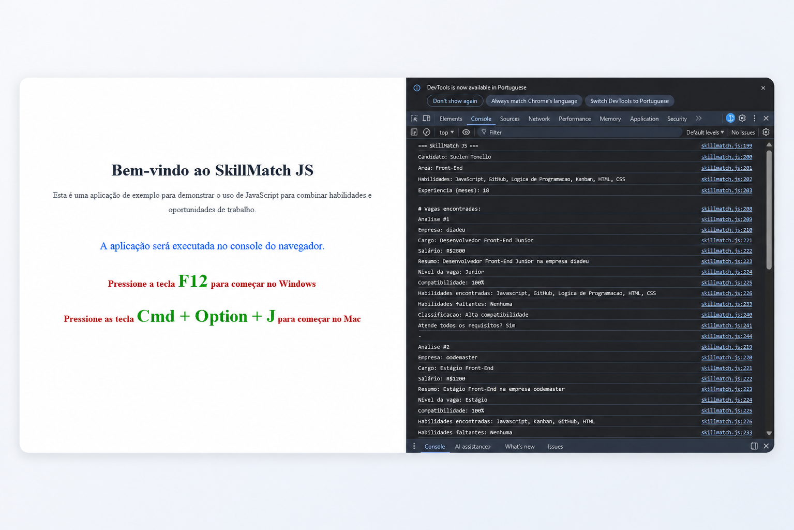

# SkillMatch JS

Simulador de compatibilidade entre perfil de candidato e vagas de Front-End Junior, desenvolvido em JavaScript puro.

## Sobre o projeto

O SkillMatch JS compara as habilidades de uma pessoa candidata com vagas ficticias de Front-End Junior e apresenta:

- percentual de compatibilidade por vaga;
- habilidades encontradas;
- habilidades faltantes;
- classificacao da compatibilidade;
- vaga com maior aderencia;
- recomendacao de estudo.

## Grupo de criação do projeto

- @Agnaldokorb
- suelentonello85-lab
- juvarle

## Professor Front-End "Javascript"

- @eduardoworrel

## Objetivo

Praticar os principais conceitos estudados no modulo:

- logica de programacao;
- tipos de dados;
- operadores e condicionais;
- estruturas de repeticao;
- funcoes e arrow functions;
- arrays e metodos de array;
- objetos e POO;
- classes, construtor, heranca e this;
- callback, closure, Promise e async/await.

Tambem exercitar organizacao com Kanban, versionamento com Git/GitHub e comunicacao tecnica no README.

## Estrutura do projeto

```txt
skillmatch-js/
├── index.html
├── skillmatch.js
├── README.md
├── planejamento/
|   └── tarefas-kanban.md
└── assets/
    └── mapa-mental.png
```

## Como executar

Voce pode executar de duas formas simples:

**1. Navegador sem clonar o repositorio**

- Abra o Chrome.
- Pressione F12.
- Abra a aba Console.
- Cole o conteudo de skillmatch.js.
- Pressione Enter.

**2. Navegador clonando o repositorio**

- Clone o repositorio:
  ```bash
  git clone https://github.com/Agnaldokorb/skillMatch-js.git
  ```
- abra a pasta clonada no VsCode
- instale a extenção **LIVE SERVER**
- click com o botão direito do mause sobre **index.html**
- selecione **open with live server**
- na janela do navegador que abrir siga os passos indicados

## Requisitos funcionais atendidos

- RF01: objeto candidato com nome, area, habilidades, experiencia e preferencia de modelo de trabalho.
- RF02: lista com 3 vagas ficticias.
- RF03: calculo de compatibilidade por vaga.
- RF04: classificacao em Alta, Media e Baixa compatibilidade com if.
- RF05: listagem de habilidades faltantes por vaga.
- RF06: identificacao da vaga mais compativel.
- RF07: recomendacao de estudo com base nas faltas recorrentes.
- RF08: uso de metodos de array (map, filter, find, every e reduce).
- RF09: classe Vaga.
- RF10: heranca com classe VagaFrontEnd extends Vaga.
- RF11: uso de this em metodos da classe.
- RF12: callback para mensagem de encerramento da analise.
- RF13: closure para contador de analises.
- RF14: Promise e async/await para simular carregamento de vagas.

## Requisitos tecnicos atendidos

- VS Code como editor principal.
- Extensoes recomendadas listadas neste README.
- Kanban para organizacao de tarefas.
- Repositorio publico no GitHub com versionamento por commits.
- Uso de branches seguindo um fluxo simplificado.

### Como a internet funciona (resumo)

A internet conecta dispositivos por meio de redes. Quando abrimos um site, o navegador envia uma requisicao para um servidor, e o servidor responde com os arquivos da aplicacao (HTML, CSS, JavaScript e dados).

### Arquitetura cliente-servidor (resumo)

Neste modelo, o cliente (navegador) solicita informacoes e o servidor responde. Neste projeto, a funcao com Promise simula essa comunicacao ao "buscar" vagas com atraso, como se os dados viessem de um servidor real.

### Var, let e const (resumo)

- var: possui escopo de funcao e pode gerar comportamentos inesperados em blocos.
- let: possui escopo de bloco e permite reatribuicao.
- const: possui escopo de bloco e nao permite reatribuicao da referencia.

No projeto, foi priorizado o uso de let e const.

## Extensoes recomendadas e utilizadas no VS Code

- JavaScript (ES6) code snippets.
- Prettier - Code formatter.
- Error Lens.
- GitLens.

## Versionamento e GitHub Flow simplificado

Branches sugeridas no projeto avaliativo:

- main
- develop
- feat/index
- feat/estrutura-projeto
- feat/calculo-compatibilidade
- feat/readme-tarefas

Exemplos de mensagens de commit:

- feat: cria estrutura inicial do projeto
- feat: Criada estrutura de pastas e arquivos inicial
- feat: Adicionada a pagina index ao projeto
- feat: Desenvolvido o README e o tarefas-kanban inicial
- feat: adicionado dados do candidato
- feat: dados vagas
- feat: calculo e compatibilidade
- Fix: retirado codigo comentado na produção
- fix: apagado comentarios feitos durante a criação do projeto para manter o codigo limpo e organizado
- docs: Atualização do README.md 

## Feramentas ultilizadas

**desenvolvimento**

- VScode
- Windows

**pesquisa**

- Google
- ChatGPT

## Kanban

O planejamento das tarefas foi organizado com Trello em **https://trello.com/invite/b/6a0872c432914715b4d1eb6e/ATTI3ae7ffd6782eae12522f9c0b4cf353d8034745C7/mini-projeto-avaliativo-modulo-01-semana-06**

Colunas utilizadas:

- Backlog
- A Fazer
- Em Andamento
- Concluido

## Video de demonstracao

Video de ate 5 minutos (em grupo) abordando:

- objetivo e demonstracao do sistema;
- como executar;
- organizacao no Kanban;
- estrategia de branches;
- melhorias futuras.

Link do video: **...**

## Checklist final de entrega

- [x] Repositorio publico no GitHub
- [x] Arquivo skillmatch.js
- [x] Arquivo README.md
- [x] Quadro Kanban
- [x] Objeto candidato
- [x] Pelo menos 3 vagas ficticias
- [x] Uso de arrays, objetos, strings, numeros e booleanos
- [x] Uso de if e operadores logicos/matematicos
- [x] Uso de let e const
- [x] Uso de while
- [x] Uso de funcoes e arrow functions
- [x] Uso de metodos de array (map, filter, find, every e reduce)
- [x] Uso de classe, construtor, heranca e this
- [x] Uso de callback, closure, Promise e async/await
- [ ] Video publicado com permissao de leitura por link
- [ ] Links enviados no AVA


## Mapa mental do projeto


## imagem do Index.html



## imagem do console (Resultado esperado)


